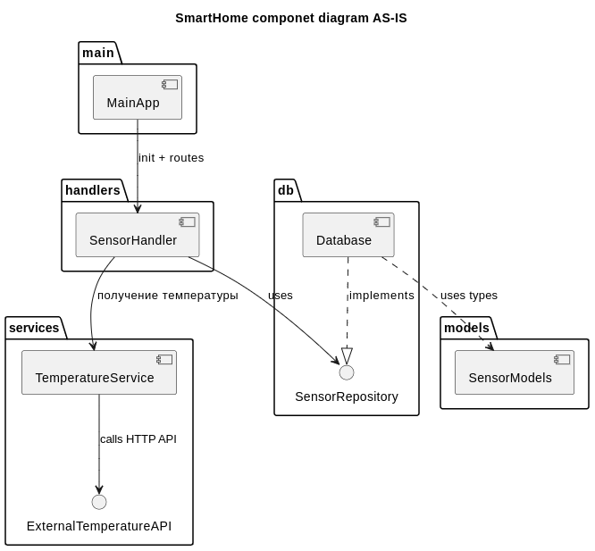

# Project_template

Это шаблон для решения проектной работы. Структура этого файла повторяет структуру заданий. Заполняйте его по мере работы над решением.

# Задание 1. Анализ и планирование

<aside>

Чтобы составить документ с описанием текущей архитектуры приложения, можно часть информации взять из описания компании и условия задания. Это нормально.

</aside>

## 1. Описание функциональности монолитного приложения

### Компоненты приложения Умный дом

Монолитное приложение Умный дом состоит из следующих компонентов:

* **MainApp** - исполняемый файл для запуска приложения.
* **SensorHandler**  - компонент, реализующий сервисы для получения запросов на управление датчиками от пользователя.
* **TemperatureService** - компонет, реализующий сервисы для взаимодействия с датчиками температуры.
* **Database** - компонент, реализующий получение информации из базы данных о зарегистрированных сервисов.
* **SensorModels** - компонент, описывающий модель данных приложения Умный дом.

Визуализацию текущей структуры исходного кода приложения Умный дом можно посмотреть на диаграме Smart home component diagram as-is:



Далее подробнее рассмотрим устройство каждого компонента.

#### MainApp
Исполнительный файл `main.go`. При запуске: 

* **DB**: устанавливает связь с БД по адресу из переменной окруженя: *DATABASE_URL*.
* **TemperatureService**: подготавливает к работе сервисы для взаимодействия с датчиками температуры используя переменную окруженя: *TEMPERATURE_API_URL*.
* **SensorHandler**: подготавливает к работе сервисы для получения запросов на управления датчиками.
* **Server**: запускает сервер для работы приложения.


#### SensorHandler

Компонент из файла `./handlers/sensors.go` реализует входящие сервисы для запросов на управление датчиками:

* **GetSensors**  Реализует входящий сервис `GET /api/v1/sensors` для запроса списка зарегистрированных датчиков.
* **GetSensorByID**  Реализует входящий сервис `GET /api/v1/sensors/:id` для запроса информации по конкретному зарегистрированному датчику.
* **GetTemperatureByLocation**  Реализует входящий сервис `GET /api/v1/sensors/temperature/:location` для запроса текущей темперетуры зарегистрированного датчика отопления по названию места его установки.
* **CreateSensor**  Реалзует входящий сервис `POST /api/v1/sensors` для регистрации датчика.
* **UpdateSensor**  Реализет входящий сервис `PUT /api/v1/sensors/:id` для обновления зарегистрированного датчика.
* **DeleteSensor**  Реализует входящий сервис `DELETE /api/v1/sensors/:id` для удаления зарегистрированного датчика.
* **UpdateSensorValue**  Реализует входящий сервис `PATCH /api/v1/sensors/:id/value` для включения/выключения датчика и установки рабочего значения.


#### TemperatureService

Компонент из файла `./services/temperature_service.go` реализует сисходящие сервисы для взаимодействия с датчиками температуры:

* **GetTemperature** Реализует исходящий сервис `GET /temperature?location=:location` для запроса температуры датчика по месту установки.
* **GetTemperatureByID** Реализует исходящий сервис `GET /temperature/:id` для запроса температуры датчика по его id.


#### Database

Компонент из файла `./db/db.go` реализует функции получения информации из базы данных по заренистрированным датчикам:

* **GetSensors** - запрос в БД на получения списка всех заренистрированных датчиков.
* **GetSensorByID** - запрос в БД на получение информации по id конкретного датчика.
* **CreateSensor** - запрос в БД на регистрацию нового датчика.
* **UpdateSensor** - запрос в БД на обновление зарегистрированного датчика.
* **DeleteSensor** - запрос в БД на удаление зарегистрированного датчика.
* **UpdateSensorValue** - запрос в БД на включение/выключение датчика и установку его значения.


#### SensorModels

Компонент из файла ./models/sensor.go описывает модель данных:

* **Sensor** - общая модель датчиков.
* **SensorCreate** - модель для создания датчика.
* **SensorUpdate** - модель для обновления датчика.


#### Дополнительные компоненты

##### init.sql

Cкрипт для создания БД smarthome. При запуске:

* Создает БД smarthome.
* Создает таблицу sensors для хранения информации по датчикам.
* Создает иднексы в таблице.


##### go.sum и go.mod
* **go.sum** - файл контроля целостности зависимостей.
* **go.mod** - файл декларации модуля.

##### Dockerfile

Файл создания Docker образа с приложением SmartHome:

* Рабочая директория `/app`.
* Директория приложения `/app/smarthome`.
* Порт `8080`.

### Функционал приложения Умный дом

1. **Управление устройствами**

Управление устройствами осуществляется через web-интерфейс специалистами компании Тёплый дом, пользователям этот функционал не доступен. Управление устройством предполагает:

   * Добавление датчиков отопления (POST /api/v1/sensors) 


   * Обновление датчиков отопления (PUT /api/v1/sensors/:id)


   * Удаление датчиков отопления (DELETE /api/v1/sensors/:id)


   * Просмотр информации по всем датчикам (GET /api/v1/sensors)


   * Просмотр информации конкретного датчика (GET /api/v1/sensors/:id)


2. **Управление отоплением**

Пользователь может управлять отоплением исползьзуя web-интерфейс. Для пользователя доступно включение/выключение датчика и установка необходимой температуры.

   * Включение/выключение датчика и изменение температуры (PATCH /api/v1/sensors/:id/value)


3. **Мониторинг температуры**

Пользователь может отслеживать температуру помещения используя web-интерфейс. Для просмотра информации по датчику необходимо знать его местоположение.

   * Просмотр информации конкретного датчика по местоположению (GET /api/v1/sensors/:location)


### 2. Анализ архитектуры монолитного приложения

* **Язык программирования**: Go
* **База данных**: PostgreSQL
* **Архитектура**: Монолитная, все компоненты системы (обработка запросов, бизнес-логика, работа с данными) находятся в рамках одного приложения.
* **Взаимодействие**: Синхронное, запросы обрабатываются последовательно.
* **Масштабируемость**: Ограничена, так как монолит сложно масштабировать по частям.
* **Развертывание**: Требует остановки всего приложения.

### 3. Определение доменов и границы контекстов

Опишите здесь домены, которые вы выделили.

### **4. Проблемы монолитного решения**

- …
- …
- …

Если вы считаете, что текущее решение не вызывает проблем, аргументируйте свою позицию.

### 5. Визуализация контекста системы — диаграмма С4

Добавьте сюда диаграмму контекста в модели C4.

Чтобы добавить ссылку в файл Readme.md, нужно использовать синтаксис Markdown. Это делают так:

```markdown
[Текст ссылки](URL)
```

Замените `Текст ссылки` текстом, который хотите использовать для ссылки. Вместо `URL` вставьте адрес, на который должна вести ссылка. Например:

```markdown
[Посетите Яндекс](https://ya.ru/)
```

# Задание 2. Проектирование микросервисной архитектуры

В этом задании вам нужно предоставить только диаграммы в модели C4. Мы не просим вас отдельно описывать получившиеся микросервисы и то, как вы определили взаимодействия между компонентами To-Be системы. Если вы правильно подготовите диаграммы C4, они и так это покажут.

**Диаграмма контейнеров (Containers)**

Добавьте диаграмму.

**Диаграмма компонентов (Components)**

Добавьте диаграмму для каждого из выделенных микросервисов.

**Диаграмма кода (Code)**

Добавьте одну диаграмму или несколько.

# Задание 3. Разработка ER-диаграммы

Добавьте сюда ER-диаграмму. Она должна отражать ключевые сущности системы, их атрибуты и тип связей между ними.

# Задание 4. Создание и документирование API

### 1. Тип API

Укажите, какой тип API вы будете использовать для взаимодействия микросервисов. Объясните своё решение.

### 2. Документация API

Здесь приложите ссылки на документацию API для микросервисов, которые вы спроектировали в первой части проектной работы. Для документирования используйте Swagger/OpenAPI или AsyncAPI.

# Задание 5. Работа с docker и docker-compose

Перейдите в apps.

Там находится приложение-монолит для работы с датчиками температуры. В README.md описано как запустить решение.

Вам нужно:

1) сделать простое приложение temperature-api на любом удобном для вас языке программирования, которое при запросе /temperature?location= будет отдавать рандомное значение температуры.

Locations - название комнаты, sensorId - идентификатор названия комнаты

```
	// If no location is provided, use a default based on sensor ID
	if location == "" {
		switch sensorID {
		case "1":
			location = "Living Room"
		case "2":
			location = "Bedroom"
		case "3":
			location = "Kitchen"
		default:
			location = "Unknown"
		}
	}

	// If no sensor ID is provided, generate one based on location
	if sensorID == "" {
		switch location {
		case "Living Room":
			sensorID = "1"
		case "Bedroom":
			sensorID = "2"
		case "Kitchen":
			sensorID = "3"
		default:
			sensorID = "0"
		}
	}
```

2) Приложение следует упаковать в Docker и добавить в docker-compose. Порт по умолчанию должен быть 8081

3) Кроме того для smart_home приложения требуется база данных - добавьте в docker-compose файл настройки для запуска postgres с указанием скрипта инициализации ./smart_home/init.sql

Для проверки можно использовать Postman коллекцию smarthome-api.postman_collection.json и вызвать:

- Create Sensor
- Get All Sensors

Должно при каждом вызове отображаться разное значение температуры

Ревьюер будет проверять точно так же.


